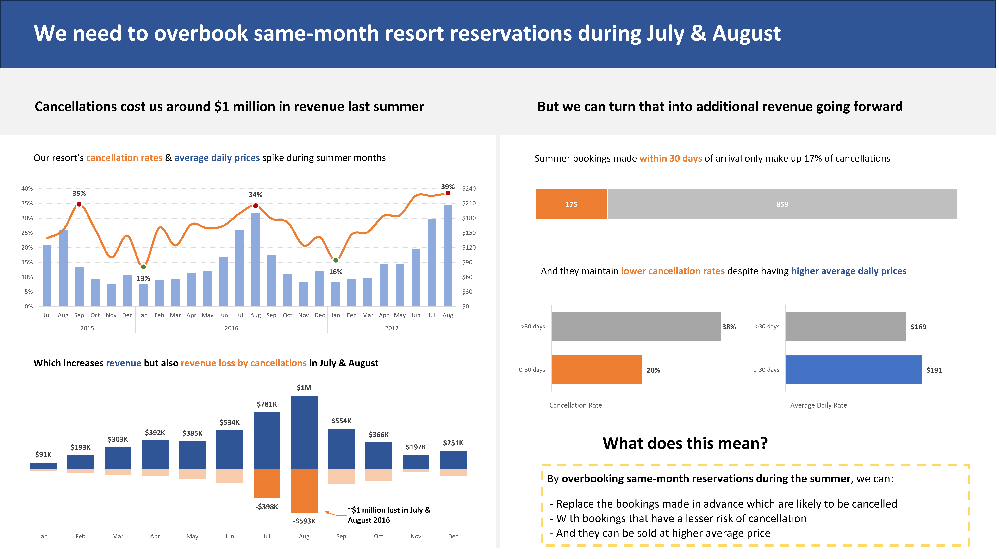
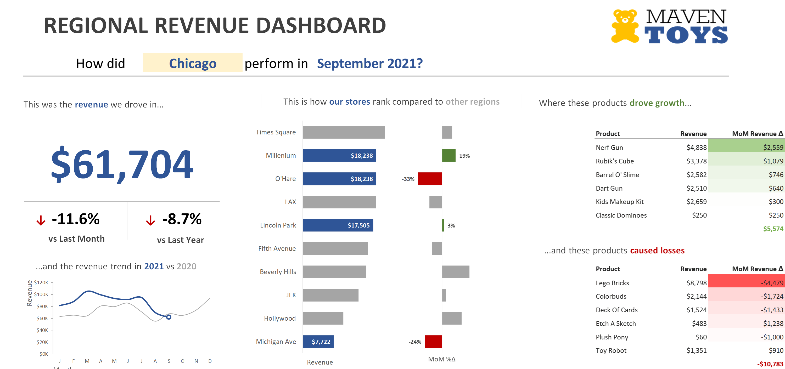

&nbsp;

&nbsp;

## Advanced dashboards

Interactive dashboards in Excel, for data filtering, sorting and analysis, including identifying effective metrics and visual elements. Custom visuals for a monthly report for a toy company, help a hotel chain bring their data insights to life, and help students research career paths.

